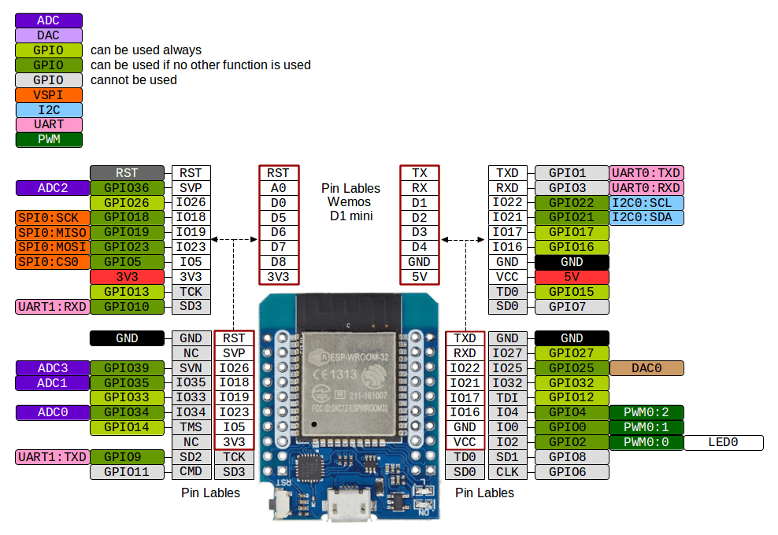
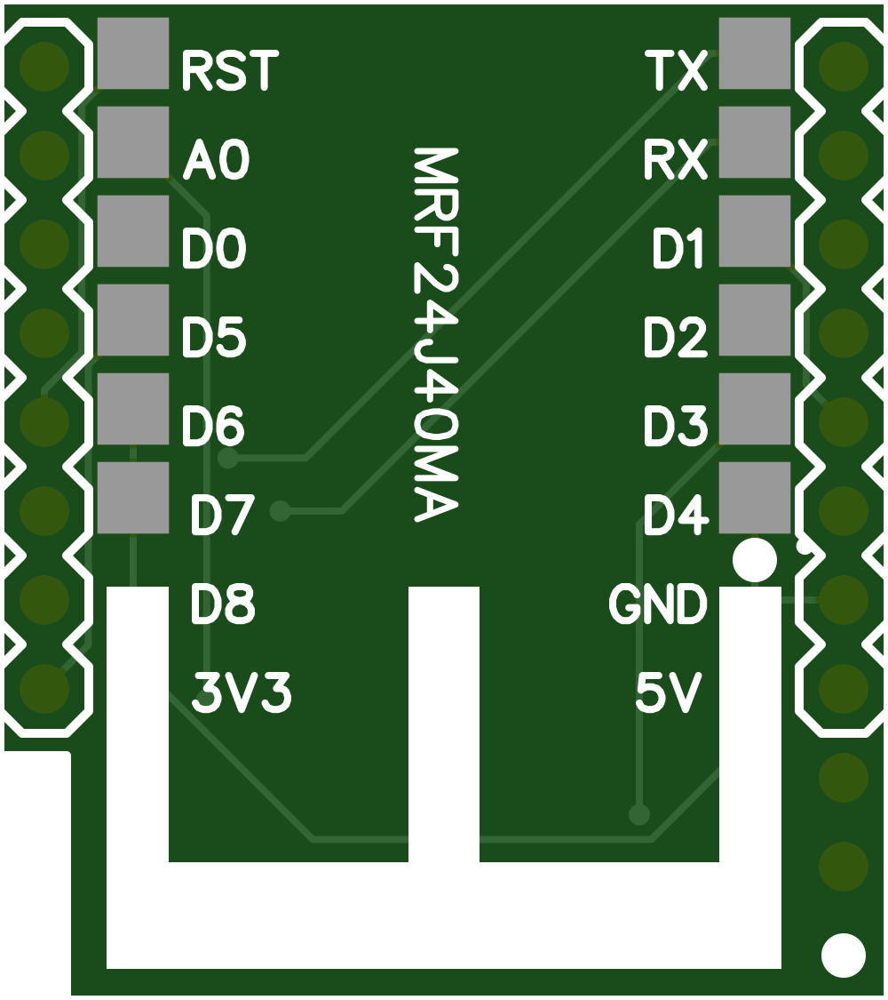
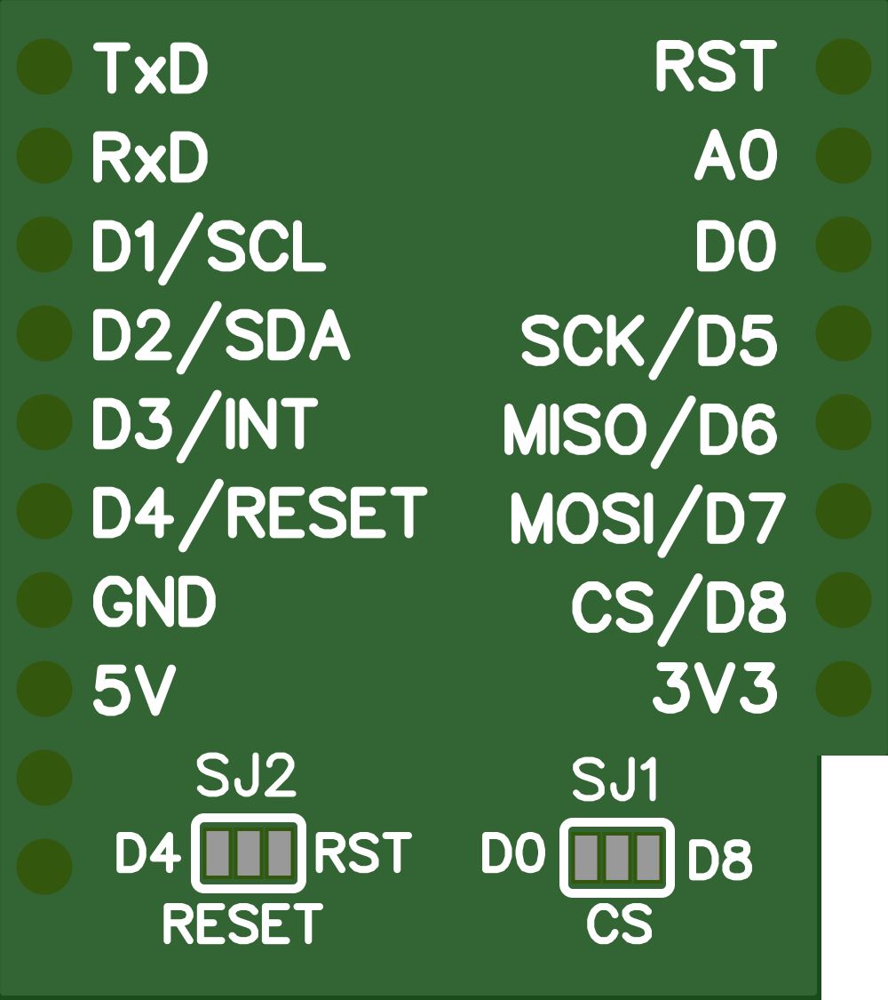

# WEMOS to MRF24J40

Wiring:
Taken from: https://i1.wp.com/www.esp32learning.com/wp-content/uploads/2018/12/MH-ET_LIVE_D1_mini_ESP32_pinout.png and 
https://github.com/r0oland/ESP32_mini_KiCad_Library

|WEMOS Pin|WEMOS ESP32 GPIO|WEMOS ESP8266 GPIO|MRF24J40|Description|
|--|--|--|--|--|
1.3|26|D0|8|GPIO 26 to 8 - CS|
1.4|18|D5|6|GPIO 18 to 6 - SCK|
1.5|19|D6|7|GPIO 19 to 6 - SDO|
1.6|23|D7|5|GPIO 23 to 6 - SDI|
1.7|5|D8|8|GPIO 5 to 8 - CS (Alternative)|
1.8|3.3v|3.3v|10|3.3v Power for MRF24J40|
2.5|17|D3|4|GPIO 17 to 4 - INT|
2.6|16|D4|2|GPIO 16 to 2 - Reset|
2.7|GND|GND|1,11,12|Ground- Must connect 1,11 & 12|

# Gerber file

This wiring is based on the shield posted here from Gunar Schorcht:
https://doc.riot-os.org/group__boards__esp32__mh-et-live-minikit.html
I emailed him and he was very kind to email me the Gerber files he made so I have had them manufactured. Many thanks Gunar.

|Top|Bottom|
|--|--|
||

The schematic file has the wiring with SJ1 and SJ2, I have decided to use GPIO26 for CS, and GPIO16 for reset rather than using the main reset.