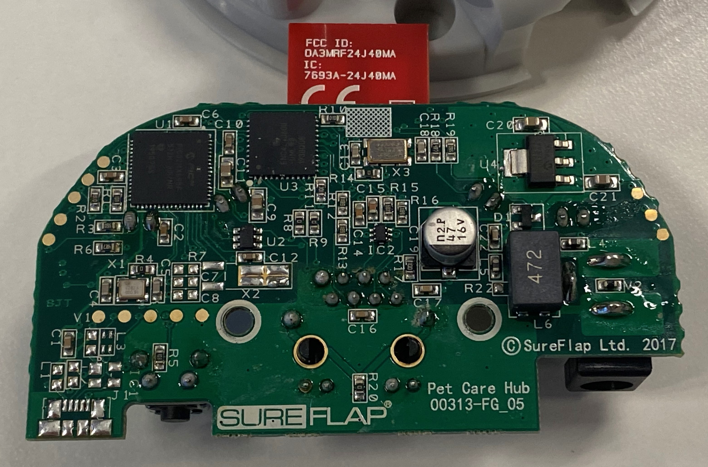
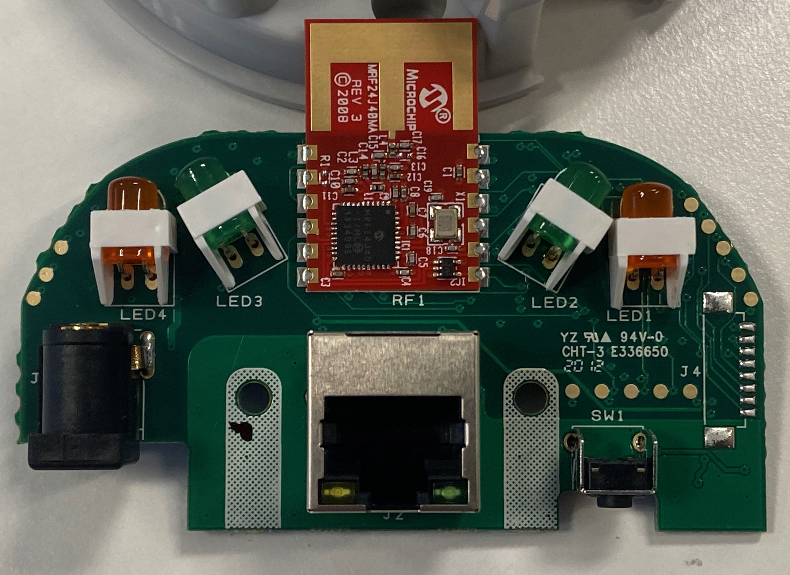
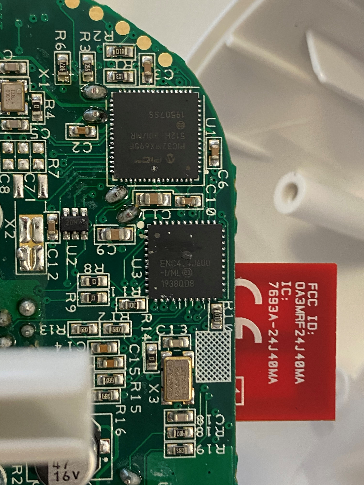
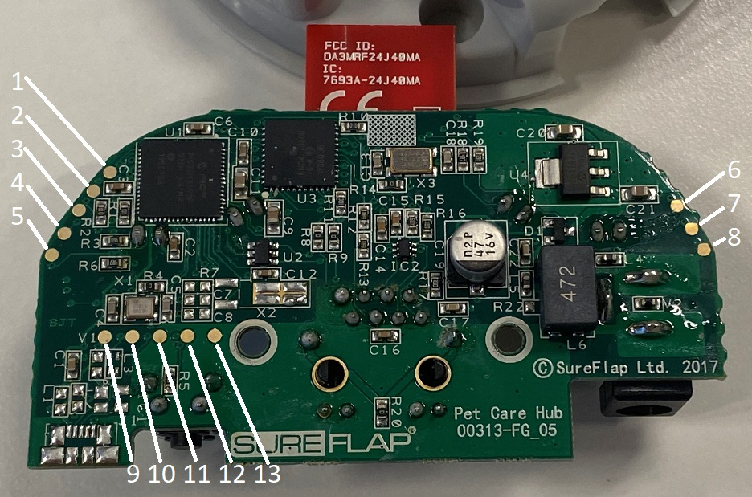
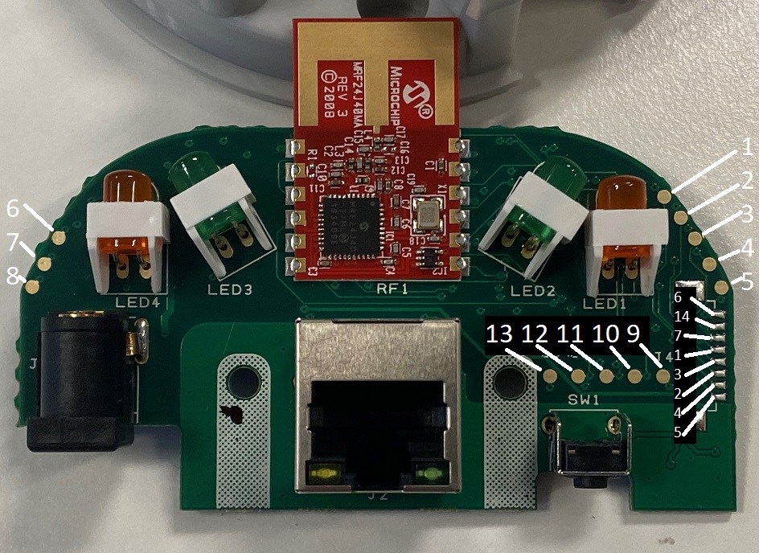

# Hub Teardown

This documents up the known pins for the hub that has the following:
| Component | Description |
| -- | -- |
| CPU |PIC32MX695F512H - PIC CPU in 64 Pin (H version) TQFP form factor |
| Radio | MRF24J40 - Microchip Zigbee / MiWi radio controller |
| Ethernet | ENC424J600 Ethernet controller |
 
## Datasheets
Below is links to the datasheets found on the Microchip site, these links may break so the PDFs are also downloaded and included here.

### PIC32MX
There are two revisions of the PIC32MX and I find the v2 better.
https://ww1.microchip.com/downloads/en/DeviceDoc/PIC32MX_Datasheet_v2_61143B.pdf
Also V1 if required (for completeness)
https://ww1.microchip.com/downloads/en/devicedoc/pic32mx_datasheet_v1_61143a.pdf
There is also a specific PIC32MX6xx/7xx series datasheet which is much the same informaiton as the above two datasheets:
https://www.microchip.com/content/dam/mchp/documents/MCU32/ProductDocuments/DataSheets/PIC32MX5XX6XX7XX_Family)Datasheet_DS60001156K.pdf
Main page: https://www.microchip.com/en-us/products/microcontrollers-and-microprocessors/32-bit-mcus/pic32-32-bit-mcus/pic32mx

### MRF24J40MA
The radio is a MRF24J40 but it is in the MA package so you will need the main datasheet for the information about the CPU and the MA datasheet for the board pin information:

MRF24J40: https://ww1.microchip.com/downloads/en/DeviceDoc/39776C.pdf
MRF24J40MA: https://ww1.microchip.com/downloads/en/DeviceDoc/MRF24J40MA-Data-Sheet-70000329C.pdf
Main page: https://www.microchip.com/mrf24j40

## Using PICKIT3

A site detailing using the PICKIT3 to connect up to a PIC32MX695 CPU to extract the firmware.

https://blog.rapid7.com/2019/04/30/extracting-firmware-from-microcontrollers-onboard-flash-memory-part-3-microchip-pic-microcontrollers/

## High resolution photos

High resolution photos of both sides of the hub:

Front
 

Back

CPU

## Hub pins
The pads on both sides of the board connect to the other side, so the below photos show the pin connections on both sides of the boards.
This may not be 100% correct so please check this before connecting anything.

The serial port speed is 57600 8/N/1 with flow control disabled.

Front with pins
 

Back  with pins

| Pin Number | CPU Pin | Description |
| -- | -- | -- |
| 1 | 17 | PGC2 used for ICSP debugger |
| 2 | 7 | /MCLR via 100R |
| 3 | 18 | PGD2 used for ICSP debugger |
| 4 | 31 | U2RX - UART RX for the serial console |
| 5 | 32 | U2TX - UART TX for the serial console |
| 6 | 10, 26, 38 | Vdd - 3.3v power supply |
| 7 | 9,25,41 | Vss - Ground for UART and ICSP |
| 8 | - | Vin 5Vdc barrel plug |
| 9 | - | USB connector (unpopulated) USB+? |
| 10 | 36 | USB D- (unpopulated L3) |
| 11 | 37 | USB D+ (unpopulated L3) |
| 12 | 61 | PMD0/RE0 Connected to Reset Button (?) |
| 13 | 9,25,41 | Vss - Ground for UART and ICSP |
| 14 | - | NC |

Side connector pin mapping:
Just including this for ease of reading
| Connector Pin | aka Pin | CPU Pin | Description |
| -- | -- | -- | -- |
| 1 | 6 | 10, 26, 38 | Vdd - 3.3v Positive supply |
| 2 | - | NC |
| 3 | 7 | 9,25,41 | Vss - Ground |
| 4 | 1 | 17 | PGC2 used for ICSP debugger |
| 5 | 3 | 18 | PGD2 used for ICSP debugger |
| 6 | 2 | 7 | /MCLR via 100R |
| 7 | 4 | 31 | U2RX - UART RX for the Console output |
| 8 | 5 | 32 | U2TX - UART TX for the Console output |
