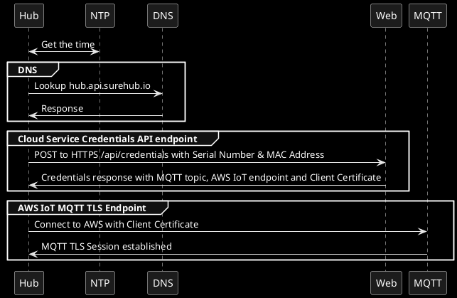
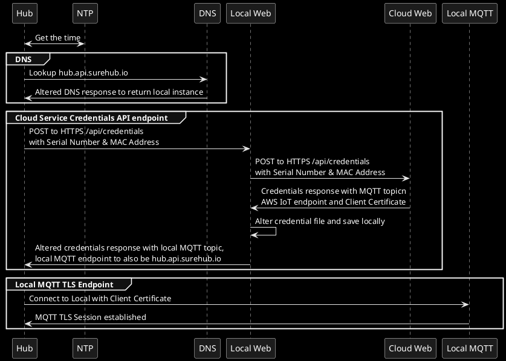

# Documentation

Below is the standard and Pet Hub Local altered boot process to help explain how the local instance works.

## Standard Hub boot process

As per the below standard flow it is:
- Query DNS for hub.api.surehub.io
- Connect to HTTPS Cloud service to retrieve credentials and client certificate
- Connect to AWS IoT MQTT with client certificate 

## Pet Hub Local Hub altered boot process

As per the below the altered flow is:
- Query DNS but get the response for hub.api.surehub.io to point to the local docker container or webserver
- Local Web on first connection proxies the request to the Cloud Web to retrieve the Credentials file
- Alters credentials file to point to local MQTT endpoint and have a consistent topic name rather than UUID value and saves original and new credentials file locally
- Responds to Hub with altered credentials file
- Connect to local MQTT with client certificate but it doesn't validate the certificate

